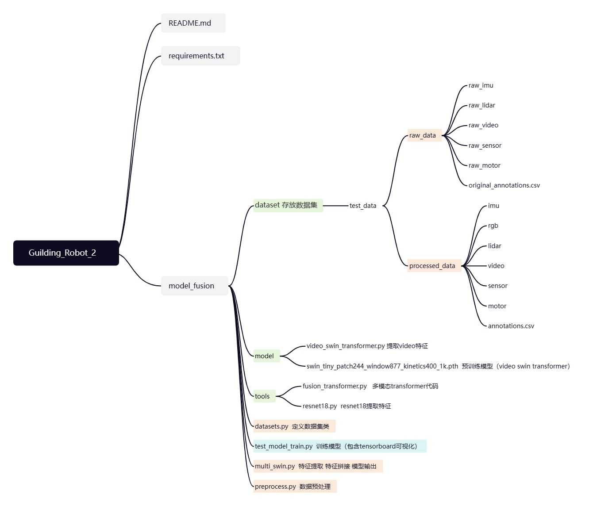

# Guiding_Robot_2
## 模态

雷达、IMU、RGB、腿部video、力传感器+电机参数

## Environment

```
conda create -n guide python=3.9
conda activate guide
pip install torch==1.12.1+cu113 torchvision==0.13.1+cu113 torchaudio==0.12.1 --extra-index-url https://download.pytorch.org/whl/cu113
pip install -r requirements.txt -i https://pypi.tuna.tsinghua.edu.cn/simple
```

## Tensorboard

```
tensorboard --logdir train_log --bind_all --port 7780
```

## Code structure



## Dataset

annotations.csv

```
point_cloud,rgb,video,imu,sensor,motor,label
```

文件命名

```
name + '_' + str(t_start) + '_' + str(t_end)
```
